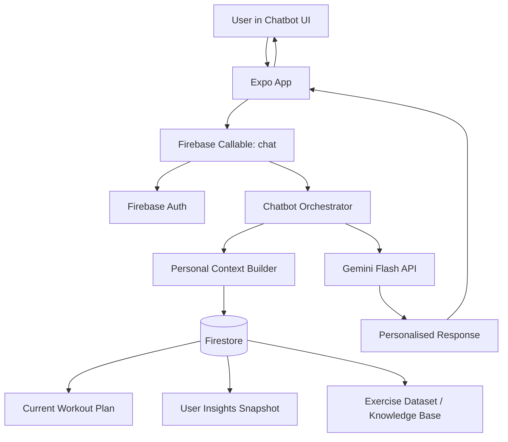

# Plan: Weight Update Insights + Firebase-Personalised Chatbot

## Purpose

This plan covers two new features for the Fit smart fitness application:

1. **Post-weight-update insights**: after every weight update, the app should show useful workout statistics, including the active week, most calorie-burning week, most active exercises, and exercise-level performance details.
2. **Chatbot linked to workout plan and Firebase user data**: the chatbot should read the user's profile, current workout plan, recent workout logs, weight data, insights snapshot, and exercise dataset so it can give personalised answers instead of generic replies.

The plan matches the current project structure using Expo React Native, Firebase Authentication, Firestore, Python Cloud Functions for plan/insights, and Node.js Cloud Functions for the chatbot.

---

# Feature 1: Post-Weight-Update Exercise and Weekly Insights

## 1. Current situation

Existing related files:

- `components/weigh-in-modal.tsx`
  - Lets the user enter a new weight.
  - Calls `recordWeight(uid, weightKg)`.
  - Closes the modal after saving.
- `lib/measurements.ts`
  - Writes the measurement to `users/{uid}/measurements/{measurementId}`.
  - Updates `users/{uid}.weightKg` and `users/{uid}.weightLastUpdatedAt`.
- `hooks/use-measurements.ts`
  - Reads the user's measurement history.
- `hooks/use-body-stats.ts`
  - Calculates weight change and BMI from measurement history.
- `hooks/use-weekly-stats.ts`
  - Calculates last 7 days workout totals.
- `contexts/workout-history.tsx`
  - Reads `users/{uid}/workouts`.
- `functions/main.py` and `functions/insights.py`
  - Already maintain `users/{uid}/insights/snapshot` when workouts, measurements, achievements, plans, and profile data change.

Missing part:

- After saving weight, the user does not receive a full explanation of what happened in their training week.
- The system does not yet show the best calorie-burning week after weight update.
- Exercise-level calories are not fully stored yet, so the app cannot accurately rank exercises by calorie burn unless it estimates calories from the session.

---

## 2. Feature goal

After every weight update, show a **Weight Update Insights** screen or bottom sheet with:

- Latest weight.
- Weight change since last weigh-in.
- Weight change over 30 days.
- This week's workout summary.
- Most active week by calories burned.
- Most active day in the current week.
- Top calorie-burning exercises.
- Most repeated exercises.
- Most trained muscle groups.
- Total sets, reps, duration, calories, and XP for top exercises.
- A short personalised message based on the user's goal.

Example message:

> Your weight is now 74.2 kg, down 0.6 kg from your last weigh-in. This week you completed 3 workouts, burned 1,240 kcal, and your most active exercise was Pushups with 210 estimated kcal. Your strongest calorie-burning week was Apr 29 - May 5 with 1,540 kcal.

---

## 3. User flow

### Flow A: User logs weight

1. User opens Dashboard.
2. User taps **Body Stats**.
3. User taps **Log a weigh-in**.
4. User enters new weight.
5. App saves the weight to Firestore.
6. System calculates updated insights.
7. App opens a new **Weight Update Insights** sheet.
8. User can tap:
   - **View activity details**
   - **View top exercises**
   - **Ask chatbot about this progress**
   - **Close**

### Flow B: User asks chatbot after weight update

1. User taps **Ask chatbot about this progress**.
2. App opens the chatbot with a prepared prompt:
   - `Explain my latest weight update and workout progress.`
3. Chatbot reads Firebase data and gives personalised feedback.

---

## 4. Required Firestore data

### Existing collections

```text
users/{uid}
users/{uid}/measurements/{measurementId}
users/{uid}/workouts/{workoutId}
users/{uid}/plans/{planId}
users/{uid}/achievements/{achievementId}
users/{uid}/xp_events/{eventId}
users/{uid}/insights/snapshot
```

### Existing workout document fields

```ts
type WorkoutSessionDoc = {
  id: string;
  completedAt: Timestamp;
  durationMin: number;
  caloriesKcal: number;
  exercisesCompleted: number;
  xp: number;
  planId?: string;
  dayNum?: number;
  exercises?: CompletedExerciseLog[];
  notes?: string;
};
```

### Extend `CompletedExerciseLog`

Current file:

```text
lib/workouts.ts
```

Current type should be expanded from this:

```ts
type CompletedExerciseLog = {
  name: string;
  primaryMuscle?: string;
  imageId?: string;
  plannedSets: number;
  plannedReps: number;
  actualSets: number;
  weightKg?: number;
  rpe?: number;
};
```

To this:

```ts
type CompletedExerciseLog = {
  exerciseId?: string;
  name: string;
  primaryMuscle?: string;
  secondaryMuscles?: string[];
  category?: string;
  equipment?: string;
  imageId?: string;

  plannedSets: number;
  plannedReps: number;
  actualSets: number;
  actualReps?: number;

  weightKg?: number;
  rpe?: number;

  startedAt?: string;
  endedAt?: string;
  durationSec?: number;
  durationMin?: number;
  caloriesKcal?: number;
  xp?: number;
};
```

Why this is needed:

- `durationMin` and `caloriesKcal` per exercise allow accurate ranking.
- `exerciseId` links the log back to the dataset.
- `primaryMuscle`, `category`, and `equipment` allow better summaries.
- `rpe` and `weightKg` help identify intensity and personal records.

---

## 5. New insights document

Create a generated document for the latest weight update.

Recommended path:

```text
users/{uid}/insights/latestWeightUpdate
```

Optional historical path:

```text
users/{uid}/weight_update_insights/{measurementId}
```

Use both if you want history. Use only `latestWeightUpdate` if you want simpler implementation.

### Suggested schema

```ts
type LatestWeightUpdateInsight = {
  userId: string;
  measurementId: string;
  generatedAt: Timestamp;
  schemaVersion: number;

  weight: {
    currentKg: number;
    previousKg?: number;
    deltaSinceLastKg: number;
    delta30dKg: number;
    delta30dPercent: number;
    direction: 'up' | 'down' | 'flat';
    goalAlignment: 'good' | 'neutral' | 'needs_attention';
    message: string;
  };

  currentWeek: {
    weekStartIso: string;
    weekEndIso: string;
    workouts: number;
    activeDays: number;
    minutes: number;
    caloriesKcal: number;
    xp: number;
    plannedWorkouts?: number;
    adherencePercent?: number;
    topDay?: {
      dateIso: string;
      minutes: number;
      caloriesKcal: number;
      workouts: number;
    };
  };

  mostActiveWeek: {
    weekStartIso: string;
    weekEndIso: string;
    workouts: number;
    activeDays: number;
    minutes: number;
    caloriesKcal: number;
    xp: number;
    reason: string;
  };

  topExercises: TopExerciseStat[];
  topMuscles: TopMuscleStat[];
  suggestions: string[];
};

type TopExerciseStat = {
  exerciseId?: string;
  name: string;
  primaryMuscle?: string;
  category?: string;
  equipment?: string;
  timesCompleted: number;
  totalSets: number;
  totalReps: number;
  totalDurationMin: number;
  totalCaloriesKcal: number;
  totalXp: number;
  avgRpe?: number;
  bestWeightKg?: number;
  lastPerformedAt?: string;
  contributionPercent: number;
};

type TopMuscleStat = {
  muscle: string;
  sessions: number;
  exercises: number;
  totalCaloriesKcal: number;
  totalSets: number;
  totalReps: number;
};
```

---

## 6. Calculation rules

### 6.1 Weight change

Use measurement history ordered by `recordedAt`.

Rules:

- `currentKg`: latest measurement.
- `previousKg`: measurement before latest.
- `deltaSinceLastKg = currentKg - previousKg`.
- `delta30dKg = currentKg - baselineWeightAround30DaysAgo`.
- Direction:
  - `flat` if absolute delta is less than `0.3 kg`.
  - `up` if delta is greater than `0.3 kg`.
  - `down` if delta is less than `-0.3 kg`.

Goal alignment:

```ts
if primaryGoal === 'lose_weight':
  down = good
  flat = neutral
  up = needs_attention

if primaryGoal === 'build_muscle':
  up or flat = good/neutral
  sharp down = needs_attention

if primaryGoal === 'stay_fit':
  flat = good
  big up/down = needs_attention
```

### 6.2 Weekly grouping

Group workouts by week.

Recommended helper:

```ts
weekStartIso = Monday date of completedAt
weekEndIso = Sunday date of completedAt
```

For each week calculate:

- Number of workouts.
- Active days.
- Total duration.
- Total calories.
- Total XP.
- Top day by calories.
- Top exercises.

### 6.3 Most active week

Pick the week with the highest `caloriesKcal`.

Tie-breakers:

1. Higher total minutes.
2. Higher workout count.
3. More recent week.

### 6.4 Top exercises by calories

If exercise-level calories exist:

```ts
totalCaloriesKcal += exercise.caloriesKcal
```

If exercise-level calories do not exist yet, estimate calories from the workout session:

```ts
exerciseEffort = max(1, actualSets * plannedReps)
totalEffort = sum(exerciseEffort for all exercises in session)
exerciseCalories = session.caloriesKcal * (exerciseEffort / totalEffort)
```

Fallback if reps/sets are missing:

```ts
exerciseCalories = session.caloriesKcal / exercises.length
```

This estimation should be marked internally as:

```ts
calorieSource: 'tracked' | 'estimated'
```

### 6.5 Top exercises stats

For each exercise calculate:

- Times completed.
- Total sets.
- Total reps.
- Total duration.
- Total calories.
- Total XP.
- Average RPE.
- Best weight.
- Last performed date.
- Percentage contribution to weekly calories.

---

## 7. Backend implementation plan

### 7.1 Add helper functions in `functions/insights.py`

Add these functions:

```py
def week_start(dt):
    # return Monday date


def compute_weekly_activity(workouts):
    # group workouts by week
    # return currentWeek, mostActiveWeek, weeklyHistory


def compute_exercise_leaderboard(workouts):
    # return top exercises by calories, duration, count, XP


def compute_muscle_leaderboard(workouts):
    # return top trained muscle groups


def build_weight_update_insight(profile, measurements, workouts):
    # return latestWeightUpdate payload
```

### 7.2 Update measurement trigger in `functions/main.py`

Current trigger:

```py
@firestore_fn.on_document_written(
    document="users/{uid}/measurements/{measurementId}", region="us-central1"
)
def on_measurement_write(...):
    sections = insights.refresh_measurement_sections(uid, db)
    _merge_insights(uid, sections)
```

Extend it to also write `latestWeightUpdate`:

```py
latest_update = insights.build_weight_update_insight(profile, measurements, workouts)
user_ref.collection("insights").document("latestWeightUpdate").set(
    latest_update,
    merge=True,
)
```

Also merge a summary into `users/{uid}/insights/snapshot`:

```py
{
  "latestWeightUpdateSummary": {
    "currentKg": 74.2,
    "deltaSinceLastKg": -0.6,
    "currentWeekCalories": 1240,
    "mostActiveWeekCalories": 1540,
    "topExercise": "Pushups"
  }
}
```

This helps the chatbot read a small summary quickly.

---

## 8. Frontend implementation plan

### 8.1 Create a hook

New file:

```text
hooks/use-weight-update-insights.ts
```

Responsibilities:

- Read `users/{uid}/insights/latestWeightUpdate`.
- Return loading state.
- Return typed insight object.
- Handle missing insight gracefully.

Example:

```ts
export function useWeightUpdateInsights() {
  const { user } = useAuth();
  const [insight, setInsight] = useState<LatestWeightUpdateInsight | null>(null);
  const [loading, setLoading] = useState(true);

  useEffect(() => {
    if (!user) return;
    const ref = doc(db, 'users', user.uid, 'insights', 'latestWeightUpdate');
    return onSnapshot(ref, (snap) => {
      setInsight(snap.exists() ? snap.data() as LatestWeightUpdateInsight : null);
      setLoading(false);
    });
  }, [user]);

  return { insight, loading };
}
```

### 8.2 Create a component

New file:

```text
components/weight-update-insight-sheet.tsx
```

Sections:

1. **Weight Result Card**
   - Current weight.
   - Difference since last update.
   - 30-day trend.
2. **This Week Card**
   - Workouts completed.
   - Minutes.
   - Calories.
   - XP.
   - Active days.
3. **Most Active Week Card**
   - Week date range.
   - Calories.
   - Minutes.
   - Workouts.
   - Reason it was the best week.
4. **Top Exercises Card**
   - Top 3 exercises by calories.
   - Muscle, sets, reps, calories, XP.
5. **Suggestion Card**
   - Simple recommendation based on goal.
6. Buttons:
   - `View Activity`
   - `Ask Coach`
   - `Close`

### 8.3 Update `WeighInModal`

Current behavior:

```ts
await recordWeight(user.uid, Math.round(weightKg * 100) / 100);
onClose();
```

New behavior:

```ts
const measurementId = await recordWeight(user.uid, Math.round(weightKg * 100) / 100);
onSaved?.(measurementId);
onClose();
```

Update props:

```ts
type Props = {
  visible: boolean;
  onClose: () => void;
  onSaved?: (measurementId: string) => void;
};
```

Then in `app/dashboard/body-stats.tsx` and `app/dashboard/body-stat/[key].tsx`:

```tsx
const [insightOpen, setInsightOpen] = useState(false);

<WeighInModal
  visible={logOpen}
  onClose={() => setLogOpen(false)}
  onSaved={() => setInsightOpen(true)}
/>

<WeightUpdateInsightSheet
  visible={insightOpen}
  onClose={() => setInsightOpen(false)}
/>
```

### 8.4 Add Dashboard card

In `app/(tabs)/dashboard.tsx`, add a small card under **Body stats**:

```text
Latest weigh-in insight
- Current week calories
- Top exercise
- Most active week
```

Button:

```text
View insight
```

---

## 9. UI content example

### Weight Result

```text
Weight updated
74.2 kg
-0.6 kg since last update
30-day trend: down 1.4 kg
```

### This Week

```text
This week
3 workouts
142 min
1,240 kcal
670 XP
4 active days
```

### Most Active Week

```text
Most active calorie week
Apr 29 - May 5
1,540 kcal burned
178 min · 4 workouts
This was your strongest week because your workout duration and active days were both higher than average.
```

### Top Exercises

```text
1. Pushups
   Chest · 5 times · 18 sets · 240 reps · 210 kcal · 320 XP

2. Goblet Squat
   Legs · 3 times · 12 sets · 180 reps · 190 kcal · 280 XP

3. Seated Cable Rows
   Back · 3 times · 12 sets · 150 reps · 170 kcal · 250 XP
```

### Suggestion

```text
You are progressing toward your weight-loss goal. Keep your weekly calories burned close to your best active week, but avoid increasing volume too quickly.
```

---

## 10. Firestore rules

Add read-only access for the owner:

```js
match /users/{uid}/insights/{doc} {
  allow read: if isOwner(uid);
  allow create, update, delete: if false;
}

match /users/{uid}/weight_update_insights/{doc} {
  allow read: if isOwner(uid);
  allow create, update, delete: if false;
}
```

If `insights/{doc}` already exists in the rules, only add `weight_update_insights` if using that historical collection.

---

## 11. Acceptance criteria

The feature is complete when:

- After every weight save, the user sees a full insight sheet.
- Insight sheet shows current weight, weight delta, current week stats, most active week, and top exercises.
- Top exercises include calories, sets, reps, count, XP, and muscle group.
- If exercise-level calories are missing, the system estimates calories safely and consistently.
- Chatbot can explain the latest weight update using Firebase context.
- No user can read another user's weight insights.
- Feature works even if user has no workouts yet.
- Feature works even if user has only one measurement.
- Feature does not block saving weight if insight generation is delayed.

---

# Feature 2: Link Chatbot to Workout Plan, Dataset, and Firebase User Stats

## 1. Current situation

Existing related files:

- `app/(tabs)/chatbot.tsx`
  - Chat UI.
  - Sends message to backend.
  - Shows responses, suggestions, quizzes, feedback.
- `lib/chatbot.ts`
  - Client callable wrapper for chatbot function.
- `hooks/use-chat-session.ts`
  - Handles messages, retry, feedback, and session state.
- `functions-chatbot/src/index.ts`
  - Callable function `chat`.
  - Handles authentication, rate limit, quiz grading, and message validation.
- `functions-chatbot/src/chatbot/orchestrator.ts`
  - Main chatbot pipeline.
- `functions-chatbot/src/personalize.ts`
  - Reads user profile, insight snapshot, current plan, workouts fallback, and achievements.
- `functions-chatbot/src/chatbot/promptBuilder.ts`
  - Builds Gemini prompt with profile, recent activity, chat memory, knowledge base, and safety rules.
- `functions-chatbot/src/chatbot/knowledgeRetriever.ts`
  - Retrieves documents from `fitness_knowledge`.
- `functions/main.py`
  - Generates workout plans from the exercise dataset.
- `functions/insights.py`
  - Builds the user insight snapshot.
- `users/{uid}/plans/{planId}`
  - Stores the active generated workout plan.

Good existing foundation:

- Chatbot already runs server-side, so it can securely read Firestore with Admin SDK.
- Firestore rules already prevent client writes to chatbot sessions and memory.
- The chatbot already reads `users/{uid}/insights/snapshot`.
- The chatbot already reads the current plan enough to know today's focus and exercise count.

Missing part:

- Chatbot context is still too summarized.
- It needs full access to today's workout exercises, plan schedule, exercise instructions, recent completion state, latest weight update insight, and most active exercises.
- It should use the dataset as a source of truth for exercise details.

---

## 2. Feature goal

The chatbot should answer questions like:

- `What workout should I do today?`
- `Which exercises in my plan burn the most calories?`
- `Explain my weight update.`
- `Why is my progress slow this week?`
- `Which exercise should I focus on for fat loss?`
- `Can you replace pushups with another chest exercise?`
- `How many workouts did I complete this week?`
- `What muscle did I train the most?`
- `Give me a short version of today's plan.`
- `I missed my workout yesterday, what should I do?`

The chatbot should answer using:

- User profile.
- Fitness goal.
- Fitness level.
- Equipment.
- Days per week.
- Session duration.
- Current plan.
- Today's plan.
- Recent workouts.
- Latest weight trend.
- Latest weight update insight.
- Most active exercises.
- Dataset exercise instructions.
- Safety rules.

---

## 3. Recommended architecture



Important rule:

- Do **not** send sensitive user stats from the client to the chatbot.
- The client should send only the message.
- The Cloud Function should read the user's Firebase data securely using `req.auth.uid`.

---

## 4. Firestore data the chatbot should read

### User profile

Path:

```text
users/{uid}
```

Fields:

```ts
{
  displayName,
  age,
  gender,
  heightCm,
  weightKg,
  primaryGoal,
  fitnessLevel,
  equipment,
  daysPerWeek,
  sessionMinutes,
  currentPlanId,
  stats,
  lastWorkoutAt,
  planStartDate,
  health: { injuries: [] }
}
```

### Current workout plan

Path:

```text
users/{uid}/plans/{currentPlanId}
```

Fields:

```ts
{
  profile: {
    goal,
    level,
    equipment,
    daysPerWeek,
    sessionMinutes
  },
  days: [
    {
      day,
      title,
      estimatedMinutes,
      exercises: [
        {
          exerciseId,
          name,
          sets,
          reps,
          primaryMuscles,
          secondaryMuscles,
          equipment,
          category,
          instructions,
          images
        }
      ]
    }
  ]
}
```

### Recent workouts

Path:

```text
users/{uid}/workouts
```

Read limit:

```text
last 30 days or last 60 sessions
```

Needed fields:

```ts
{
  completedAt,
  durationMin,
  caloriesKcal,
  exercisesCompleted,
  xp,
  planId,
  dayNum,
  exercises
}
```

### Latest weight insights

Path:

```text
users/{uid}/insights/latestWeightUpdate
```

Needed fields:

```ts
{
  weight,
  currentWeek,
  mostActiveWeek,
  topExercises,
  topMuscles,
  suggestions
}
```

### Existing snapshot

Path:

```text
users/{uid}/insights/snapshot
```

Use it for fast context:

```ts
{
  demographics,
  preferences,
  plan,
  totals,
  recent,
  streaks,
  consistency,
  personalRecords,
  weightTrend,
  achievements,
  flags
}
```

### Exercise dataset / library

Recommended collection:

```text
exercise_library/{exerciseId}
```

Suggested fields:

```ts
{
  exerciseId,
  name,
  category,
  equipment,
  primaryMuscles,
  secondaryMuscles,
  instructions,
  images,
  level,
  tags,
  aliases,
  safetyNotes,
  substitutions: [exerciseId]
}
```

This should be seeded from:

```text
fitness_data_project/outputs/workout_plan.json
functions/data/exercises.json
free-exercise-db dataset
```

---

## 5. Backend implementation plan

### 5.1 Extend chatbot personal context types

File:

```text
functions-chatbot/src/personalize.ts
```

Add structured context instead of only string tokens.

Recommended types:

```ts
type ActivePlanContext = {
  planId: string;
  goal: string;
  level: string;
  equipment: string;
  daysPerWeek: number;
  sessionMinutes: number;
  today: PlanDayContext | null;
  next: PlanDayContext | null;
  days: PlanDayContext[];
  completion: {
    completedThisWeek: number;
    plannedThisWeek: number;
    adherencePercent: number;
    completedDayNums: number[];
    remainingDayNums: number[];
  };
};

type PlanDayContext = {
  day: number;
  title: string;
  estimatedMinutes: number;
  completed: boolean;
  exercises: {
    exerciseId: string;
    name: string;
    sets: number;
    reps: number;
    primaryMuscles: string[];
    equipment: string;
    category: string;
    instructionsPreview: string[];
  }[];
};

type WeightUpdateContext = {
  currentKg?: number;
  deltaSinceLastKg?: number;
  delta30dKg?: number;
  currentWeekCalories?: number;
  mostActiveWeekCalories?: number;
  topExercises?: {
    name: string;
    totalCaloriesKcal: number;
    timesCompleted: number;
  }[];
};
```

### 5.2 Add data-loading helpers

In `functions-chatbot/src/personalize.ts`, add:

```ts
async function loadActivePlanContext(uid: string, currentPlanId?: string) {}
async function loadRecentWorkoutContext(uid: string) {}
async function loadLatestWeightUpdateContext(uid: string) {}
async function loadExerciseLibraryDocs(exerciseIds: string[]) {}
```

Keep the existing fast path:

1. Read `users/{uid}`.
2. Read `users/{uid}/insights/snapshot`.
3. Read current plan.
4. Read latest weight update insight.
5. Read exercise library docs only for exercises needed in the current answer.

### 5.3 Add a plan block to the Gemini prompt

File:

```text
functions-chatbot/src/chatbot/promptBuilder.ts
```

Add a new block:

```text
CURRENT WORKOUT PLAN
- Plan goal: fat loss
- Days/week: 4
- Session length: 45 min
- Completed this week: 2/4
- Today's workout: Day 3, Back + Arms, 5 exercises

Today's exercises:
1. Seated Cable Rows — 4x12 — Back — cable
2. Hammer Curls — 4x12 — Arms — dumbbell
3. Wide-Grip Lat Pulldown — 4x12 — Back — cable

If user asks for today's plan, answer from this block.
If user asks for replacements, match the same muscle, level, and available equipment.
```

### 5.4 Add weight update block to prompt

```text
LATEST WEIGHT UPDATE
- Current weight: 74.2 kg
- Change since last weigh-in: -0.6 kg
- 30-day change: -1.4 kg
- Current week calories: 1240 kcal
- Most active week: Apr 29 - May 5, 1540 kcal
- Top exercises: Pushups, Goblet Squat, Cable Rows
```

### 5.5 Add exercise dataset retrieval

Current `knowledgeRetriever.ts` reads from:

```text
fitness_knowledge
```

Add a second retrieval source:

```text
exercise_library
```

Use it when:

- User mentions an exercise name.
- User asks for exercise form.
- User asks for replacement.
- User asks for target muscles.
- User asks about today's plan.

Suggested function:

```ts
export async function retrieveExerciseDocs(input: {
  message: string;
  exerciseNamesFromPlan: string[];
  equipment?: string;
  goal?: string;
  fitnessLevel?: string;
}): Promise<ExerciseKnowledgeDoc[]> {}
```

Matching rules:

1. Exact exercise name match.
2. Alias match.
3. Primary muscle match.
4. Equipment match.
5. Level match.
6. Category match.

### 5.6 Add intent support

Update `intentMapper.ts` or classifier mappings to support:

```ts
type BroadIntent =
  | 'workout_plan'
  | 'todays_workout'
  | 'exercise_substitution'
  | 'exercise_form'
  | 'weight_progress'
  | 'weekly_stats'
  | 'exercise_stats'
  | 'nutrition_advice'
  | 'weight_loss'
  | 'muscle_gain'
  | 'motivation'
  | 'injury_warning'
  | 'app_help'
  | 'general_chat';
```

This allows the chatbot to pick the correct context.

---

## 6. Chatbot response rules

The chatbot should:

- Mention actual user stats when relevant.
- Use the current plan before giving a new plan.
- Avoid replacing the whole plan unless the user asks.
- Give short, clear answers first.
- Then give steps or recommendations.
- Use the dataset for exercise instructions.
- Use safety warnings for pain, injury, extreme dieting, or overtraining.
- Say when data is missing.

Example answer:

```text
You are on Day 3 today: Back + Arms. Based on your plan, start with Seated Cable Rows, then Wide-Grip Lat Pulldown, Hammer Curls, Ab Crunch Machine, and Triceps Extension.

Because you already completed 2 of 4 planned workouts this week, keep this session normal, not extra hard. Your latest weight update shows you are down 0.6 kg, so your current activity is moving in the right direction.
```

---

## 7. Frontend chatbot improvements

### 7.1 Add contextual quick prompts

File:

```text
app/(tabs)/chatbot.tsx
```

Add suggestions based on available data:

```text
Explain my latest weight update
What workout should I do today?
Which exercise burned the most calories?
Am I on track this week?
Replace an exercise in my plan
Summarise my current workout plan
```

### 7.2 Add action buttons

When chatbot response includes an action:

```ts
{
  type: 'navigate',
  label: 'Open Today Workout',
  route: '/workout/start'
}
```

Possible actions:

- Open today's workout.
- Open activity screen.
- Open body stats.
- Open workout history.
- Open weight insight.

### 7.3 Add a chatbot entry point from weight insight

In `WeightUpdateInsightSheet` add:

```tsx
<PrimaryButton
  label="Ask Coach About This"
  onPress={() => router.push({
    pathname: '/(tabs)/chatbot',
    params: { initialPrompt: 'Explain my latest weight update and workout progress.' }
  })}
/>
```

Then in `app/(tabs)/chatbot.tsx`, read `initialPrompt` and send it once.

---

## 8. Firestore security

Rules should remain strict:

```js
match /users/{uid}/plans/{planId} {
  allow read, update: if isOwner(uid);
  allow create, delete: if false;
}

match /users/{uid}/workouts/{workoutId} {
  allow read, create: if isOwner(uid);
  allow update, delete: if false;
}

match /users/{uid}/measurements/{measurementId} {
  allow read, create: if isOwner(uid);
  allow update, delete: if false;
}

match /users/{uid}/insights/{doc} {
  allow read: if isOwner(uid);
  allow write: if false;
}

match /exercise_library/{exerciseId} {
  allow read: if isSignedIn();
  allow write: if false;
}
```

The chatbot Cloud Function uses Admin SDK, so it can read these paths securely without exposing data to other users.

---

## 9. Performance plan

Avoid reading too much data inside the chatbot.

Recommended read strategy per chat message:

- Always read:
  - `users/{uid}`
  - `users/{uid}/insights/snapshot`
  - `chat_memory/{uid}`
- Read only when needed:
  - current plan document
  - latest weight update insight
  - top exercise library docs
- Avoid reading all workouts in Node chatbot if the Python insight snapshot already contains the summary.
- Let Python triggers precompute heavy analytics.
- Keep chatbot response under a reasonable token limit.

---

## 10. Testing plan

### 10.1 Unit tests

Add tests for:

- `compute_weekly_activity`
- `compute_exercise_leaderboard`
- `build_weight_update_insight`
- `loadActivePlanContext`
- `renderPlanBlock`
- `renderWeightUpdateBlock`

### 10.2 Integration tests

Test flows:

1. User logs weight with no workouts.
2. User logs weight with one workout.
3. User logs weight with multiple weeks of workouts.
4. User asks chatbot: `What should I do today?`
5. User asks chatbot: `Which exercise burned the most calories?`
6. User asks chatbot: `Explain my latest weight update.`
7. User asks chatbot for unsafe injury advice.

### 10.3 Manual testing checklist

- Save a new weigh-in.
- Confirm `users/{uid}/measurements` receives a new doc.
- Confirm `users/{uid}.weightKg` updates.
- Confirm `users/{uid}/insights/latestWeightUpdate` is created.
- Confirm the sheet opens after save.
- Confirm top exercises appear.
- Confirm current week and most active week appear.
- Open chatbot from the sheet.
- Confirm chatbot mentions the latest weight update and real workout stats.

---

# Implementation checklist

## Phase 1: Data and analytics

- [ ] Extend `CompletedExerciseLog` type in `lib/workouts.ts`.
- [ ] Add exercise ID, category, equipment, duration, calories, and XP to completed exercise logs.
- [ ] Update `contexts/workout-session.tsx` to capture per-exercise duration.
- [ ] Update manual log to store exercise-level calories and XP.
- [ ] Add weekly activity helpers in `functions/insights.py`.
- [ ] Add exercise leaderboard helpers in `functions/insights.py`.
- [ ] Add latest weight update insight builder.
- [ ] Update measurement trigger in `functions/main.py`.

## Phase 2: UI for post-weight-update insights

- [ ] Create `hooks/use-weight-update-insights.ts`.
- [ ] Create `components/weight-update-insight-sheet.tsx`.
- [ ] Update `components/weigh-in-modal.tsx` with `onSaved` callback.
- [ ] Update `app/dashboard/body-stats.tsx` to show insight sheet after save.
- [ ] Update `app/dashboard/body-stat/[key].tsx` to show insight sheet after save.
- [ ] Add latest insight card to `app/(tabs)/dashboard.tsx`.

## Phase 3: Chatbot personalisation

- [ ] Extend `functions-chatbot/src/personalize.ts` with full plan context.
- [ ] Load `users/{uid}/insights/latestWeightUpdate`.
- [ ] Add `CURRENT WORKOUT PLAN` prompt block.
- [ ] Add `LATEST WEIGHT UPDATE` prompt block.
- [ ] Add exercise dataset retrieval from `exercise_library`.
- [ ] Add new broad intents for weight progress and exercise stats.
- [ ] Update chatbot suggested prompts in `app/(tabs)/chatbot.tsx`.
- [ ] Add chatbot entry point from weight insight sheet.

## Phase 4: Rules, indexes, deployment

- [ ] Update Firestore rules for any new insight collection.
- [ ] Add Firestore indexes if queries require them.
- [ ] Deploy Python functions.
- [ ] Deploy Node chatbot functions.
- [ ] Deploy Firestore rules.
- [ ] Bootstrap insights for existing users.

---

# Suggested deployment order

```bash
# 1. Build and test app locally
npm test
npm run lint

# 2. Deploy Firestore rules and indexes
firebase deploy --only firestore:rules
firebase deploy --only firestore:indexes

# 3. Deploy Python functions for analytics and insight generation
firebase deploy --only functions:default

# 4. Build and deploy chatbot functions
cd functions-chatbot
npm run build
cd ..
firebase deploy --only functions:chatbot

# 5. Rebuild insight snapshots for existing users if needed
# Call bootstrap_insights from the app or admin script.
```

---

# Example final user experience

After logging weight:

```text
Weight Updated
74.2 kg
Down 0.6 kg since last update
Down 1.4 kg over 30 days

This Week
3 workouts · 142 min · 1,240 kcal · 670 XP
Most active day: Wednesday, 520 kcal

Most Active Week
Apr 29 - May 5
1,540 kcal · 178 min · 4 workouts

Top Exercises
1. Pushups — 210 kcal · 18 sets · 240 reps · Chest
2. Goblet Squat — 190 kcal · 12 sets · 180 reps · Legs
3. Cable Rows — 170 kcal · 12 sets · 150 reps · Back

Coach note
Your current activity supports your weight-loss goal. Try to keep this week's activity close to your best week, but increase slowly to avoid fatigue.
```

Chatbot response after pressing **Ask Coach About This**:

```text
Your latest weigh-in shows progress: you are down 0.6 kg since the last update and down 1.4 kg over 30 days. This matches your fat-loss goal.

This week you burned 1,240 kcal across 3 workouts. Your most active exercise was Pushups, followed by Goblet Squat and Cable Rows.

For the next step, keep the same workout frequency and focus on completing your planned sessions before adding extra volume.
```

---

# Main risks and fixes

| Risk | Fix |
|---|---|
| Exercise-level calories are missing | Store per-exercise calories going forward and estimate old sessions by sets/reps. |
| Insight generation may be delayed after weight save | Show loading state, then auto-refresh when Firestore snapshot updates. |
| Chatbot reads too much data | Precompute summaries in `insights/snapshot` and `latestWeightUpdate`. |
| User asks medical/injury questions | Keep existing safety rules and add clear warnings. |
| Firestore costs increase | Use summaries and limit recent workout reads. |
| Inaccurate calorie estimates | Label them as estimated internally and improve later with MET-based formulas. |

---

# Recommended priority

Build in this order:

1. **Latest weight insight backend** because it powers both UI and chatbot.
2. **Weight insight sheet UI** because users immediately see value after weight update.
3. **Exercise-level logging improvement** because top-exercise stats need better accuracy.
4. **Chatbot prompt context extension** because it depends on the new insight data.
5. **Exercise library retrieval** because it makes chatbot answers more detailed and dataset-based.

